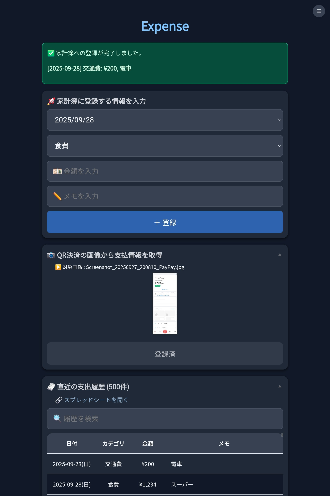

# Expense

A household expense tracking application that runs on Termux.
It features receipt scanning via OCR, a web-based user interface, and integration with Google Sheets.

## Key Features

- **Web UI:** An intuitive web interface for adding, editing, and viewing expense records.
  - It can be installed as PWA.
- **OCR Functionality:** Automatically extracts dates and amounts from receipt images captured with your smartphone's camera.
- **Data Visualization:** Displays daily and monthly expenditures in graphs for a visual overview of your finances.
- **Asset Management:** Track the status of your assets.
- **Google Sheets Integration:** Records all data in a Google Sheet for flexible data management.

## Screenshot



## Requirements

- Python 3.10 ~ 3.13
- Tesseract OCR
- Google Cloud Platform credentials (`credentials.json`)
- (Optional) Termux (Terminal emulator for Android)

## Installation

1.  Clone the repository:
    ```bash
    git clone https://github.com/szkny/expense.git
    cd expense
    ```
2.  Install the required Python packages:
    ```bash
    make install
    ```
3.  Place your Google Cloud Platform credentials file at:
    - `src/expense/config/credentials.json`

## Usage

1.  Start the web server:
    ```bash
    make serve
    ```
2.  Open `http://localhost:8000` in your web browser.
3.  (If using Termux) You can also open the web UI directly with the following command:
    ```bash
    make webui
    ```
